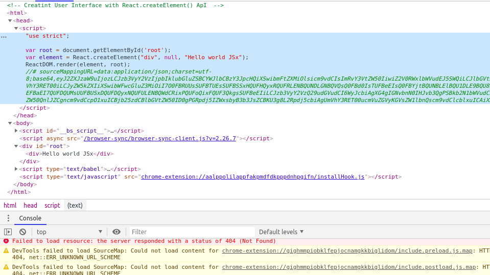

# React Js 

* lecture 1 : In Lecture One We have Create a User Interface with Javascript .
* lecture 2 : In lecture Two We Have Create a User Interface With React.createElement() API , We Can Download React for our Work with NPM but there is service called __unpkg__  , if we go there it will tell us how to use it . By This(__unpkg__) we Can Get Any Package that is on Npm ,just type like this in URl 

>                 unpkg.com/:package@:version/:file

```javascript
    https://unpkg.com/react@16.12.0/umd/react.development.js"
    https://unpkg.com/react-dom@16.12.0/umd/react-dom.development.js"
```
> After typing in the URL Copy , it will gives us URL Of that minified Version of that pkg and just copy it and paste it into our code.

## JSX

* Most COmmunity Not Using React.createElement , instead they are using JSX 
* JSx is HTML like syntax and Javascript
* if We want to render JSX on DOM we will get an error like below
  > SyntaxError: expected expression, got '<'
  * this Actually Means That Browser Cannot JSx , Browser Only Understand JS , So we have Compile this JSx COde Into JS 
  * We Can COnvert JSx to JS by a Tool named __babel__ 

```javascript 
// using JSx
  const element = <div>Hello world JSx</div>
// bable convert above jsx into something like below
  const element = React.createElement('div',null,"Hello world JSx")
```

* first add below jsx into Html File with script tag
```javascript
https://unpkg.com/@babel/standalone@7.8.3/babel.js
```

> How Jsx Works (-_-)

* in head tag there is script in which we have compile version of JSx
* and In div with a id of root in which we have JSX ;



## {} 
* in these curly braces we can put any javascript expression and then javascript evalute this expression into value and then it gets place into that position for the React.createElement Call 

> FOr Example 
```javascript

// FROM
const children = "Hello World"
const element = <div>{chilren} </div>

//TO
const element = <div>Hello World</div>

```

## Validating Props 
